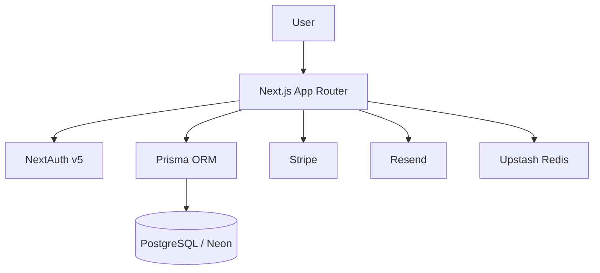

# Spendly

> Financial Chaos → Financial Clarity

Spendly is a personal finance tracker built for **intentional awareness, not automated bookkeeping**. It favors fast manual entry, clear budgets, and honest goals over bank-sync automation.

The core thesis is simple: small moments of conscious engagement with each transaction build the financial mindfulness that automatic bank synchronization quietly erodes. Every feature is evaluated against that frame — even recurring transactions produce **drafts the user must confirm** rather than silent ledger entries. This deliberately sets Spendly apart from the bank-sync category (Mint, YNAB, Monarch): the goal is **clarity, not optimization**.

---

## Project Status

Spendly is under active development. The foundation is in place; the transactional product surface is being built on top of a complete data model.

**Shipped**

- Authentication — email/password and Google OAuth, with email verification, password reset, and rate limiting
- Profile & account management — usage stats, change password, soft-delete with a 30-day grace period
- Dashboard — a live state screen reading real data from PostgreSQL via Prisma
- Marketing landing page
- Full Prisma data model for every financial entity (accounts, transactions, budgets, recurring templates/drafts, goals/contributions)
- Transactions — full read/write stack (list with filters + search, create/edit/delete drawer, transfers, soft-delete undo)
- Budgets — full read/write stack (period stepper, create/edit/archive, preset seeding, live spend)
- Recurring templates — full read/write stack (templates + drafts inbox, confirm/dismiss)
- Financial accounts — `/accounts` management (create/edit/archive/unarchive, derived balance)
- Goals — `/goals` management (create/edit/complete/delete, contributions + withdrawals)

**In progress**

- Reports & analytics
- Data export (CSV / JSON)
- Stripe Pro billing

See the [Roadmap](#roadmap) for the detailed status of each capability.

---

## Screenshots

Coming soon.

<!-- Add screenshots here, e.g.:


-->

---

## Features

Spendly's product design centers on conscious capture and a strict separation between "where am I now" (Dashboard) and "what happened over time" (Reports).

- **Manual transaction entry** — income, expense, or transfer through a slide-in drawer; re-entering an expense in a known category is designed to complete in under five seconds. Transfers are modeled as two linked records sharing a `transferPairId`.
- **Financial accounts** — multiple accounts (checking, savings, credit card, cash, investment); balances are always **derived** (`startingBalance + SUM(transactions)`), never stored, to avoid reconciliation drift.
- **Monthly budgets** — per-category spending ceilings with green / amber / red progress states. One budget per category per calendar month, no rollover.
- **Recurring templates** — generate confirmation **drafts** instead of silent ledger entries, preserving the conscious-capture moment without the typing burden.
- **Goals** — virtual progress tracking with manual contributions and withdrawals; goals never touch account balances or budgets.
- **Dashboard** — a state screen only: hero balance, monthly metric strip (income / expenses / cashflow), sparkline, and top budgets.
- **Reports** — a separate analytics module with category, income-vs-expense, cashflow, and account-balance views (Free: last 3 months; Pro: full history).
- **Data export (CSV / JSON)** — available on **all** tiers, never Pro-gated; withholding a user's own data erodes trust.
- **Authentication** — email/password and Google OAuth, with email verification and password reset.
- **Pro billing** — Stripe-powered subscription (monthly / annual).
- **Responsive web app** — mobile-first in layout, desktop-first in density.
- **Security** — row-level ownership on every query, hashed passwords, verification/reset tokens hashed at rest, and auth rate limiting.

> Implementation status varies by feature — see [Project Status](#project-status) and the [Roadmap](#roadmap). Per the project principle *"never UI without backing function,"* shipped surfaces are wired to real data, not placeholders.

---

## Tech Stack

### Framework & Language

| Technology | Version | Notes |
| ---------- | ------- | ----- |
| Next.js    | 16.2.7  | App Router, React Compiler enabled |
| React      | 19.2.4  | |
| TypeScript | ^5      | Strict mode, no `any` |

### Backend & Data

| Technology | Version | Notes |
| ---------- | ------- | ----- |
| Prisma     | 7.8.0   | Custom generator output to `src/generated/prisma` |
| @prisma/adapter-pg | 7.8.0 | Driver adapter over `pg` |
| PostgreSQL (Neon)  | —     | Pooled `DATABASE_URL` at runtime; unpooled `DIRECT_URL` for migrations |

Backend logic is implemented with Next.js Server Actions and a small set of API route handlers (used for the auth flows that need specific HTTP status codes and webhooks).

### Authentication

| Technology | Version | Notes |
| ---------- | ------- | ----- |
| NextAuth (Auth.js) | ^5.0.0-beta.31 | JWT session strategy |
| @auth/prisma-adapter | ^2.11.2 | |
| bcryptjs   | ^3.0.3  | Password hashing |
| zod        | ^4.4.3  | Input validation |

### Supporting Services

| Technology | Version | Purpose |
| ---------- | ------- | ------- |
| Stripe     | —       | Subscription billing (planned) |
| Resend     | ^6.12.4 | Transactional email (verification, password reset) |
| @upstash/ratelimit | ^2.0.8 | Auth rate limiting — fails open when unconfigured |
| @upstash/redis     | ^1.38.0 | Backing store for rate limiting |

### Styling & UI

| Technology | Version | Notes |
| ---------- | ------- | ----- |
| Tailwind CSS | ^4    | CSS-based `@theme` config in `globals.css` — no `tailwind.config.*` file |
| lucide-react | ^1.17.0 | Iconography |

UI is built from hand-rolled, server-first React components with a lightweight `cn()` class-name helper — no component framework dependency.

### Tooling

| Technology | Version | Notes |
| ---------- | ------- | ----- |
| Vitest     | ^4.1.8  | Node environment; tests cover server actions and utilities |
| ESLint     | ^9      | `eslint-config-next` |
| tsx        | ^4.22.4 | Running TypeScript scripts |

---

## Architecture Overview

Spendly is a full-stack Next.js application using the App Router. It is **server-first**: Server Components by default, with `'use client'` reserved for genuine interactivity. Persistence is PostgreSQL (Neon) through Prisma, and authentication is handled by NextAuth v5 with row-level ownership enforced in every query.

The product is organized around a three-layer conceptual model:

- **Data layer** — transactions are the canonical ledger; account balances are always derived, never stored. Categories are a flat list; merchants are optional metadata.
- **Control layer** — budgets impose monthly per-category ceilings; recurring templates generate confirmation drafts; goals track virtual progress independently of accounts and budgets.
- **Insight layer** — the Dashboard surfaces current state; Reports is a separate analytics module. The two are deliberately kept apart to prevent scope creep.



---

## Getting Started

### Prerequisites

- **Node.js ≥ 20.9** (required by Next.js 16)
- **npm**
- A **PostgreSQL** database — [Neon](https://neon.tech/) recommended
- _Optional:_ Google OAuth credentials (only needed for Google sign-in; email/password works without them)
- _Optional:_ Stripe, Resend, and Upstash credentials for billing, email, and rate limiting respectively — the app degrades gracefully without them in development

### Installation

```bash
git clone <repository-url>
cd spendly
npm install
```

`npm install` runs `prisma generate` automatically via the `postinstall` script, generating the client into `src/generated/prisma`.

---

## Environment Variables

Copy `.env.example` to `.env` and fill in the values. The variables, grouped by concern:

```env
# Database
DATABASE_URL=          # Pooled Neon connection (runtime; host contains -pooler)
DIRECT_URL=            # Unpooled Neon connection (Prisma migrations; no -pooler)

# NextAuth
AUTH_SECRET=           # Session/JWT signing secret
AUTH_URL=              # Base URL for absolute links (defaults to http://localhost:3000 in dev)
AUTH_GOOGLE_ID=        # Google OAuth client ID
AUTH_GOOGLE_SECRET=    # Google OAuth client secret

# Resend (email)
RESEND_API_KEY=
EMAIL_VERIFICATION_ENABLED=   # "false" disables verification; anything else (incl. unset) keeps it on

# Upstash (auth rate limiting; skipped / fails open when unset)
UPSTASH_REDIS_REST_URL=
UPSTASH_REDIS_REST_TOKEN=

# Stripe (billing)
STRIPE_SECRET_KEY=
STRIPE_PUBLISHABLE_KEY=
STRIPE_WEBHOOK_SECRET=
STRIPE_PRICE_ID_MONTHLY=
STRIPE_PRICE_ID_YEARLY=

# OpenAI (post-MVP / optional)
OPENAI_API_KEY=
```

---

## Database Setup

The project standard is **never `db push`** — schema changes always go through migrations. Prefer the npm scripts over raw `npx prisma`:

```bash
npm run db:migrate   # prisma migrate dev — create/apply migrations in development
npm run db:seed      # seed 20 system categories + demo data
npm run db:studio    # open Prisma Studio
npm run db:test      # quick Neon connectivity check
```

`prisma generate` runs automatically via `build` and `postinstall`, generating the client into `src/generated/prisma`. Production deployments run `npm run db:deploy` (`prisma migrate deploy`) before the app starts.

---

## Running the Project

Development:

```bash
npm run dev
```

Production:

```bash
npm run build   # prisma generate + next build
npm start
```

Testing & linting:

```bash
npm run test:run   # single CI-style Vitest run
npm test           # Vitest watch mode
npm run lint       # ESLint
```

---

## Project Structure

```text
src/
├── app/                 # App Router pages + API route handlers (auth flows)
├── components/          # UI components by feature (auth, dashboard, marketing, profile, ui)
├── actions/             # Server Actions (auth, profile)
├── lib/                 # Utilities, db fetchers, auth helpers, validations, marketing data
├── types/               # Shared TypeScript types
├── generated/prisma/    # Generated Prisma client (gitignored)
├── auth.ts              # NextAuth setup (adapter + callbacks)
├── auth.config.ts       # Edge-compatible auth config (providers, authorized callback)
└── proxy.ts             # Next.js 16 proxy/middleware re-export
```

- **`app/`** — routes and pages. The auth flows live under `app/api/auth/*` as route handlers; everything else is a Server Component page.
- **`components/`** — feature-grouped React components (`auth`, `dashboard`, `marketing`, `profile`, `ui`).
- **`actions/`** — Server Actions for form submissions and mutations.
- **`lib/`** — utilities (`format.ts`, `budget.ts`), database fetchers (`lib/db/*`), auth helpers (`lib/auth/*`), Zod schemas (`lib/validations/*`), and marketing data (`lib/marketing/*`).
- **`types/`** — shared TypeScript types and the NextAuth module augmentation.

Styling lives in `src/app/globals.css` (Tailwind v4 `@theme` tokens), not a `styles/` directory. Constants are split by convention: UI/app constants in `src/lib/constants.ts`, system-level constants in `src/lib/system-constants.ts`.

---

## Authentication

Authentication is built on **NextAuth v5 (Auth.js)** with the Prisma adapter and a JWT session strategy that exposes `user.id`.

- **Email/password** sign-in with bcrypt-hashed credentials, **and** Google OAuth
- **Email verification** and **password reset** flows powered by Resend — tokens are hashed at rest (SHA-256), single-use, and TTL-bounded
- Protected routes (`/dashboard/*`) are gated via the `authorized` callback
- **Rate limiting** via Upstash covers login, registration, password reset, and verification resend; it fails open when Redis is unconfigured
- Account deletion is a soft delete with a 30-day grace period — sign-in is blocked immediately once `deletedAt` is set

---

## Code Quality

- **TypeScript strict mode**, no `any` — proper typing or `unknown`
- **ESLint** (`eslint-config-next`)
- **Vitest** unit tests for server actions (`src/actions/**`) and utilities (`src/lib/**`); React components are intentionally out of test scope
- **Constants split** convention: UI/app constants in `src/lib/constants.ts`, system-level constants in `src/lib/system-constants.ts`
- Server-first architecture and consistent **kebab-case** filenames throughout

---

## Deployment

### Recommended Platform

- [Vercel](https://vercel.com/)

### Required Services

- Neon PostgreSQL
- _Optional but recommended:_ Google OAuth, Stripe, Resend, Upstash Redis

### Deployment Checklist

- [ ] All env vars set (see [Environment Variables](#environment-variables))
- [ ] `npm run db:deploy` runs before app start (`prisma migrate deploy`)
- [ ] `AUTH_SECRET` is a fresh production secret (never committed)
- [ ] `AUTH_URL` points to the production domain
- [ ] Stripe webhook endpoint configured and `STRIPE_WEBHOOK_SECRET` set
- [ ] HTTPS enforced

---

## Roadmap

- [x] Authentication (email/password + Google OAuth)
- [x] Email verification & password reset (hashed, single-use, TTL-bounded tokens)
- [x] Auth rate limiting (Upstash)
- [x] Profile & account management (soft delete, change password)
- [x] Complete Prisma data model + migrations
- [x] Dashboard state screen (live data)
- [x] Marketing landing page
- [x] Interactive transaction entry (income / expense / transfer)
- [x] Budgets management
- [x] Recurring templates with confirmation drafts
- [x] Financial account management (`/accounts`)
- [x] Goals management
- [ ] Reports & analytics
- [ ] Data export (CSV / JSON)
- [ ] Stripe Pro billing
- [ ] Automatic transaction categorization _(post-MVP)_
- [ ] Subscription detection _(post-MVP)_
- [ ] Bank sync via Open Banking _(post-MVP)_
- [ ] Cross-currency aggregation _(post-MVP)_
- [ ] Native mobile app _(post-MVP)_

---

## Contributing

1. Branch from `main` using `feature/[name]` or `fix/[name]`.
2. Make focused changes that match existing patterns and the project's coding standards.
3. Add Vitest tests for any new server actions or utilities.
4. Ensure `npm run test:run` and `npm run build` both pass before committing.
5. Use conventional commit messages (`feat:`, `fix:`, `chore:`, …).
6. Open a pull request describing the change.

---

## License

Private project.
