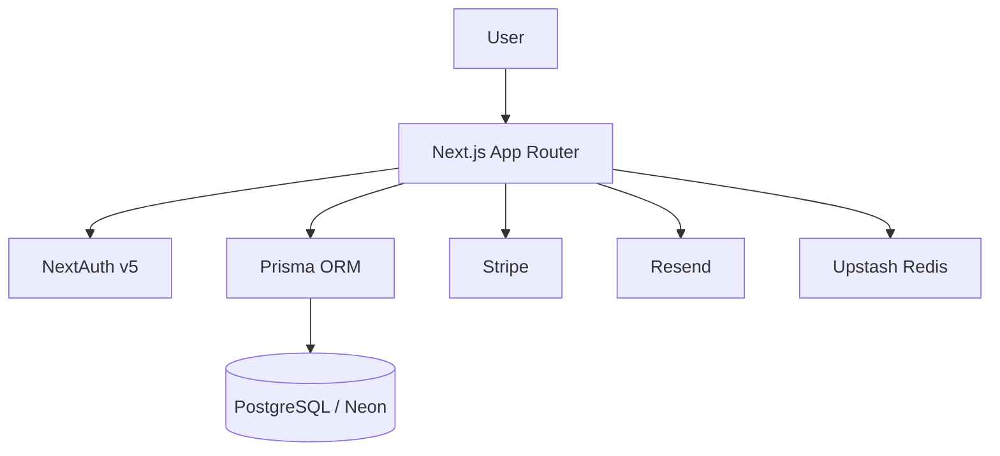

# README.md Generation Spec

## Objective

Create a professional, polished, investor-quality `README.md` for the Spendly project.

The README should immediately communicate:

- What Spendly is
- The problem it solves
- Key features
- Technology stack
- Local development setup
- Project structure
- Deployment information
- Future roadmap

The result should feel similar in quality to top open-source SaaS repositories.

> **Source-of-truth rule (read first):** Every factual claim about the stack,
> versions, environment variables, scripts, and folder layout MUST be derived
> from the live repository at generation time — not from the illustrative
> values in this spec. Authoritative sources, in order:
>
> 1. `package.json` — dependencies, versions, and npm scripts
> 2. `.env.example` — the canonical environment variable list
> 3. `prisma/schema.prisma` — data model and generator config
> 4. The actual `src/` directory tree — folder structure
> 5. `docs/project-overview.md` — product positioning, features, monetization
>
> Where this spec shows concrete values (versions, env names, trees), treat them
> as **examples to verify**, not facts to copy. If the repo disagrees with this
> spec, the repo wins.

> **Note on gitignored docs:** `CLAUDE.md`, `context/`, and `.env*` are
> gitignored. The `README.md` is therefore the **only** public-facing
> documentation — accuracy matters more than usual.

---

# Project Information

## Product Name

**Spendly**

## Tagline

Financial Chaos → Financial Clarity

## Description

Spendly is a personal finance tracker built for **intentional awareness, not
automated bookkeeping**. It favors fast manual entry, clear budgets, and honest
goals over bank-sync automation.

The core thesis: small moments of conscious engagement with each transaction
build financial mindfulness that automatic bank synchronization quietly erodes.
This deliberately differentiates Spendly from the bank-sync category (Mint,
YNAB, Monarch) — the goal is **clarity, not optimization**.

> **Positioning guardrail:** Do NOT describe Spendly as helping users "optimize"
> their finances or offering "intelligent/automatic financial guidance." That
> contradicts the product thesis. Frame it around conscious capture, clarity,
> and user-confirmed entries (even recurring transactions produce drafts the
> user must confirm).

---

# README Structure

The generated README must contain the following sections in this order.

## 1. Hero Section

Large title:

```md
# Spendly
```

Short subtitle:

```md
Financial Chaos → Financial Clarity
```

Follow with a concise 2–4 sentence project description that reflects the
positioning guardrail above (intentional awareness, manual-first, not bank-sync).

---

## 2. Screenshots Section

Placeholder section for future screenshots.

Example:

```md
## Screenshots

Coming soon.

<!-- Add screenshots here, e.g.:


-->
```

Include comments showing where screenshots should be added later.

---

## 3. Features

Create a professional feature list with short descriptions per item. Base the
list on `docs/project-overview.md`. Cover at least:

- **Manual transaction entry** — income / expense / transfer via a slide-in
  drawer; sub-5-second re-entry in a known category
- **Financial accounts** — multiple accounts (checking, savings, credit, cash,
  etc.); balances are always *derived*, never stored
- **Monthly budgets** — per-category spending ceilings with green/amber/red
  progress states
- **Recurring templates** — generate confirmation *drafts* (never silent ledger
  entries), preserving the conscious-capture moment
- **Goals** — virtual progress tracking with manual contributions and withdrawals
- **Dashboard** — a "where am I now" state screen (distinct from analytics)
- **Reports** — analytics module with category, income/expense, cashflow, and
  account-balance charts (Free: last 3 months; Pro: full history)
- **Data export (CSV / JSON)** — available on **all** tiers, not Pro-gated (a
  deliberate trust feature)
- **Authentication** — email/password **and** Google OAuth, with email
  verification and password reset
- **Pro billing** — Stripe-powered subscription (monthly / annual)
- **Responsive web app** — mobile-first layout, desktop-first density
- **Security** — row-level ownership on every query, hashed passwords, hashed
  tokens at rest, auth rate limiting

> Verify each feature against the codebase / overview before listing it. Per
> project principle "Never UI without backing function," do not list a feature
> that isn't actually present.

---

## 4. Tech Stack

Create a visually organized technology table. Pull exact versions from
`package.json` at generation time. As of writing, the real stack is:

### Framework & Language

- Next.js 16 (App Router) + React 19
- TypeScript (strict mode)

### Backend

- Next.js Server Actions + API Routes (used for webhooks, specific status codes,
  and future mobile/CLI clients)
- Prisma 7 ORM (custom generator output to `src/generated/prisma`, via the
  `@prisma/adapter-pg` driver adapter)

### Database

- PostgreSQL on Neon (pooled `DATABASE_URL` at runtime; unpooled `DIRECT_URL`
  for migrations)

### Authentication

- NextAuth v5 (Auth.js) with the Prisma adapter
- Email/password (bcrypt) + Google OAuth

### Supporting Services

- Stripe — subscription billing
- Resend — transactional email (verification, password reset)
- Upstash Redis — auth rate limiting (fails open when unconfigured)

### Styling

- Tailwind CSS v4 (CSS-based `@theme` config — no `tailwind.config.*` file)
- shadcn/ui

### Tooling

- Vitest (Node environment) for server actions & utilities
- ESLint (`eslint-config-next`)
- TypeScript

> **Do NOT list:** "Better Auth" (the project uses NextAuth v5), or "Prettier"
> (not configured — only ESLint). Do not omit Stripe, Resend, Upstash, or
> Vitest. Confirm versions from `package.json` rather than asserting them.

---

## 5. Architecture Overview

Brief explanation of the architecture. Mention:

- Full-stack Next.js (App Router), server-first (Server Components by default,
  `'use client'` only when needed)
- Three-layer conceptual model: **data** (transactions are the canonical
  ledger; account balances derived), **control** (budgets, recurring drafts,
  goals), **insight** (dashboard state screen + separate reports module)
- PostgreSQL (Neon) persistence via Prisma
- NextAuth v5 authentication layer with row-level ownership enforced in queries

Include a simple Mermaid diagram (use the **real** auth layer):



---

## 6. Getting Started

Create detailed installation instructions.

### Prerequisites

- Node.js (version per Next.js 16 requirement — Node ≥ 20.9; verify before
  asserting a number)
- npm
- A PostgreSQL database (Neon recommended)
- _Optional:_ Google OAuth credentials (only needed for Google sign-in;
  email/password works without them)
- _Optional:_ Stripe, Resend, and Upstash credentials for billing, email, and
  rate limiting respectively (the app degrades gracefully without them in dev)

### Installation

```bash
git clone <repository-url>
cd spendly
npm install
```

Note that `npm install` triggers `prisma generate` via the `postinstall` script.

---

## 7. Environment Variables

Generate this section directly from `.env.example`. Group and explain each
variable. The canonical groups are:

```env
# Database
DATABASE_URL=          # Pooled Neon connection (runtime; host contains -pooler)
DIRECT_URL=            # Unpooled Neon connection (Prisma migrations)

# NextAuth
AUTH_SECRET=           # Session/JWT signing secret
AUTH_URL=              # Base URL for absolute links (defaults to localhost:3000 in dev)
AUTH_GOOGLE_ID=        # Google OAuth client ID
AUTH_GOOGLE_SECRET=    # Google OAuth client secret

# Resend (email)
RESEND_API_KEY=
EMAIL_VERIFICATION_ENABLED=   # "false" disables verification; otherwise on

# Upstash (auth rate limiting; skipped/fails-open when unset)
UPSTASH_REDIS_REST_URL=
UPSTASH_REDIS_REST_TOKEN=

# Stripe (billing; server-only — no browser Stripe.js, so no publishable key)
STRIPE_SECRET_KEY=
STRIPE_WEBHOOK_SECRET=
STRIPE_PRICE_ID_MONTHLY=
STRIPE_PRICE_ID_YEARLY=

# OpenAI (post-MVP / optional)
OPENAI_API_KEY=
```

> Do NOT invent `GOOGLE_CLIENT_ID`, `GOOGLE_CLIENT_SECRET`, `BETTER_AUTH_SECRET`,
> or `BETTER_AUTH_URL` — those are wrong. Mirror `.env.example` exactly, including
> `DIRECT_URL`.

---

## 8. Database Setup

The project standard is **never `db push`** — always use migrations. Prefer the
existing npm scripts over raw `npx prisma`:

```bash
npm run db:migrate   # prisma migrate dev — apply/create migrations in dev
npm run db:seed      # seed system categories + demo data
npm run db:studio    # open Prisma Studio
```

Explain that `prisma generate` already runs automatically via `build` and
`postinstall`, and that the client is generated to `src/generated/prisma`.
Production deploys run `npm run db:deploy` (`prisma migrate deploy`) before the
app starts.

---

## 9. Running the Project

Development:

```bash
npm run dev
```

Production:

```bash
npm run build   # runs prisma generate + next build
npm start
```

Testing & linting:

```bash
npm run test:run   # single CI-style Vitest run
npm test           # Vitest watch mode
npm run lint       # ESLint
```

---

## 10. Project Structure

Generate the tree from the **actual** `src/` layout. Do not invent `features/`,
`hooks/`, or `styles/` folders — they do not exist. The real shape is:

```text
src/
├── app/                 # App Router pages + API routes (route handlers)
├── components/          # UI components by feature (auth, dashboard, marketing, profile, ui)
├── actions/             # Server Actions
├── lib/                 # Utilities, db fetchers, auth helpers, validations, marketing data
├── types/               # Shared TypeScript types
├── generated/prisma/    # Generated Prisma client (gitignored)
├── auth.ts              # NextAuth setup (adapter + callbacks)
├── auth.config.ts       # Edge-compatible auth config (providers, authorized callback)
└── proxy.ts             # Next.js 16 proxy/middleware re-export
```

Provide a short explanation for each folder, and note that styling lives in
`src/app/globals.css` (Tailwind v4 `@theme`), not a `styles/` directory.

---

## 11. Authentication

Explain at a high level (using NextAuth v5 / Auth.js — not Better Auth):

- Email/password sign-in (bcrypt-hashed) **and** Google OAuth
- Email verification and password reset flows (tokens hashed at rest, single-use,
  TTL-bounded), powered by Resend
- JWT session strategy exposing `user.id`
- Protected routes (`/dashboard/*`) gated via the `authorized` callback
- Auth rate limiting via Upstash (login, register, reset, resend)

---

## 12. Code Quality

Mention:

- TypeScript strict mode; no `any`
- ESLint (`eslint-config-next`)
- Vitest unit tests for server actions (`src/actions/**`) and utilities
  (`src/lib/**`) — components are intentionally out of test scope
- Constants split convention: UI/app constants in `src/lib/constants.ts`,
  system-level constants in `src/lib/system-constants.ts`
- Server-first architecture; consistent kebab-case filenames

> Do NOT claim Prettier — it is not configured.

---

## 13. Deployment

### Recommended Platform

- Vercel

### Required Services

- Neon PostgreSQL
- _Optional but recommended:_ Google OAuth, Stripe, Resend, Upstash Redis

### Deployment Checklist

```md
- [ ] All env vars set (see Environment Variables)
- [ ] `npm run db:deploy` runs before app start (prisma migrate deploy)
- [ ] `AUTH_SECRET` is a fresh production secret (never committed)
- [ ] `AUTH_URL` points to the production domain
- [ ] Stripe webhook endpoint configured and `STRIPE_WEBHOOK_SECRET` set
- [ ] HTTPS enforced
```

---

## 14. Roadmap

Generate the checklist against **actual project state**, not generic
placeholders. Core MVP features (accounts, transactions, budgets, recurring,
goals, dashboard, reports) are built or in active development — mark them
accordingly. Genuinely post-MVP items (per `project-overview.md` "Out of Scope")
belong unchecked:

```md
## Roadmap

- [x] Authentication (email/password + Google OAuth)
- [x] Financial accounts & transactions
- [x] Monthly budgets
- [x] Recurring templates with confirmation drafts
- [x] Goals
- [x] Dashboard & Reports
- [x] Data export (CSV / JSON)
- [x] Stripe Pro billing
- [ ] Automatic transaction categorization
- [ ] Subscription detection
- [ ] Bank sync (Open Banking)
- [ ] Cross-currency aggregation
- [ ] Native mobile app
```

> Verify the checked/unchecked status against the codebase and
> `docs/current-feature.md` history before finalizing.

---

## 15. Contributing

Add standard, concise contribution guidelines. Reference the project workflow
where helpful: feature branches (`feature/[name]` / `fix/[name]`), tests + build
must pass before commit, conventional commit messages.

---

## 16. License

Placeholder section:

```md
## License

Private project.
```

---

# Style Requirements

The README must:

- Use clean GitHub markdown formatting
- Be highly professional
- Be concise but informative
- Avoid marketing buzzwords (and avoid "optimize / AI guidance" framing per the
  positioning guardrail)
- Follow open-source best practices
- Use emojis sparingly and professionally
- Render correctly on GitHub
- Include code blocks where appropriate
- Include tables where they improve readability

---

# Output Requirements

Generate a complete, production-ready `README.md`.

Before output, reconcile every stack/version/env/structure claim against the
live repository (see the source-of-truth rule at the top). Do not generate
explanations about the README.

Output only the final markdown content.
